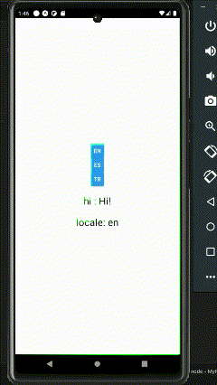

# Best Practices for Implementing i18n in React Native

## Overview
This project demonstrates how to integrate **i18n** (Internationalization) into a React Native application. The goal is to provide a seamless way of handling multiple languages and cultural settings using best practices with the **Context API** and **Provider**.

## Features
- Easy setup of multiple languages.
- Context API for managing localization.
- Provider-based solution for better maintainability.

## 🔧 Medium Article

Go to [my article on medium](https://medium.com/@gunesekrem.com/best-practices-for-implementing-i18n-in-react-native-4108550a9cb4)  and learn step by step
 
 

# RESULT

